xchen202 Final Project README  

<h1>Project Summary  </h1>
Welcome to GGG gym. We have a nice service and smiling face.  
We have the new treadmills machine. It can store your training data. Just help you be better.  
Join us! Use the treadmills machine. Haven ranking for treadmills record in every day. Have table information about the best private coach in the month. We have a professional team of private coaches to service every client's private course.

<h1>Design   </h1>
GGG gym management system is a service gym account active system. The system haven three groups to charge different types of users.    
Admin charge system base configuration. It havens User, Account, and Machine models.   
User charge charger person training in treadmills. About treadmills machine use recording.  
Coach charge service private training service.
<H4>ER diagram</h4>     
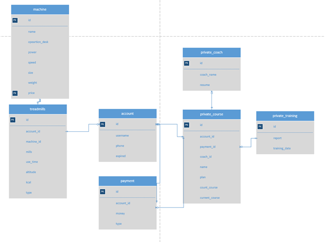     
<h4>All group</h4>
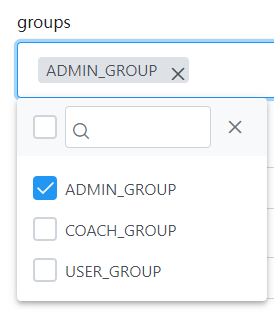   

<h4>navigation</h4>
Use the menu to visit all functions. About the read, update, and delete page can use the left top Backlink to come back to the list page.
Admin & Coach Group
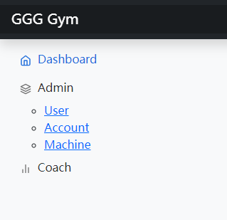  
User Group
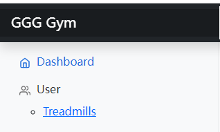  

<h4>additional</h4>
I try using dialog to complete the CRUD page operation.  
Rewrite a new class GenericController help me less code. It's an improvement by Instructor Example.   
Use the dialog to operate CRUD. Looking at this example.
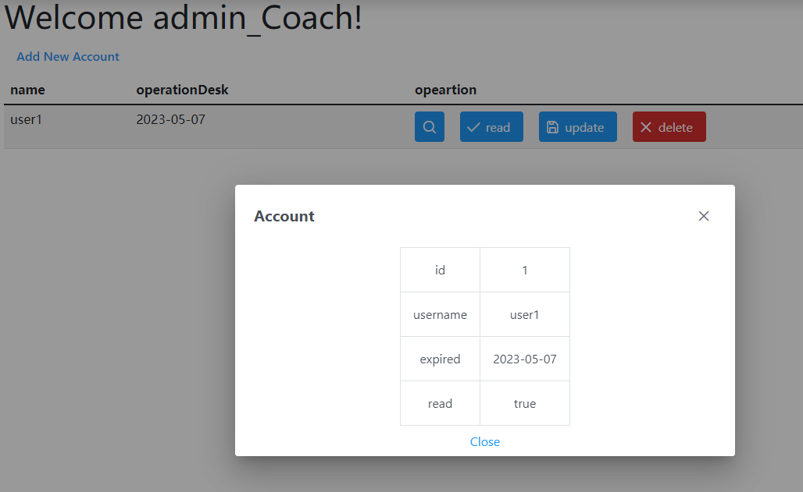   
Retaliate file:   
GenericController.java is an abstract parent class.      
MachineController.java is a children's class.   
GenericEntity.java   
FormView.java   
faces-config.xml additional dialog view handler. If you're lost this file. The DialogConfirm will not work.   
machine.xhtml tempalte file for jsp.  
pom.xml I join a UI plugin primefaces.10.0.0  

<h1>Requirements    </h1>
<h4>Software information. </h4>  
IDE: Apache NetBeans IDE 12.6    
Java: "11.0.9.1" 2020-11-04  
Server: payara 5.2.0
Mysql: 5.7    
UI component: primefaces 10.0.0 
(linked: https://www.primefaces.org/showcase/ui/overlay/confirmDialog.xhtml?jfwid=cb8c9 )
<h4>Start build project.    </h4>
download GitHub code.
https://github.com/itmd4515/itmd4515-s22-fp-WillingChin.git
Step1: Open Netbeans Git tools
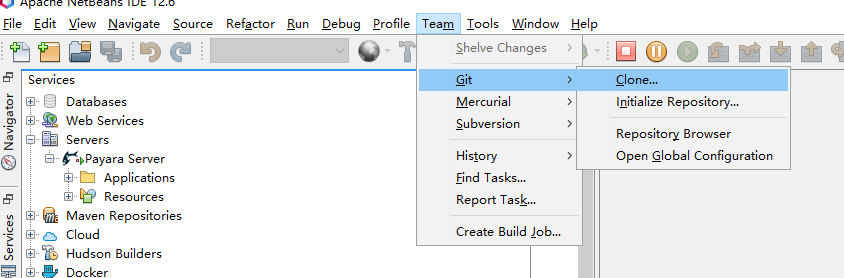
Step2: Enter URL, username, and password after clicking next to download code.
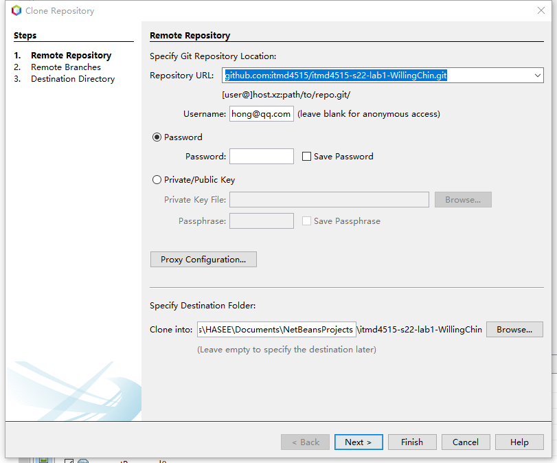

<h4>Add Payara5 server  </h4>
Step 1: Toggle the Services tab. (Services tab in the left top middle part.) Chosen Server right click "Add Server"

Step 2: Choose the payara server.
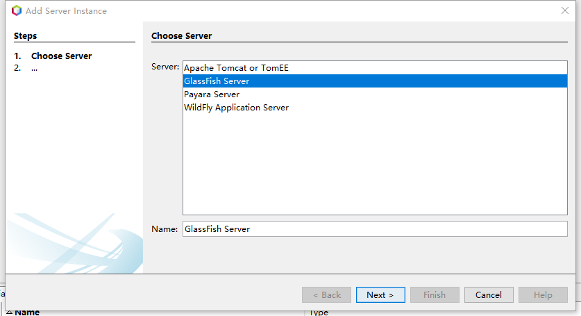
Step 3: Copy the path to the installation location.
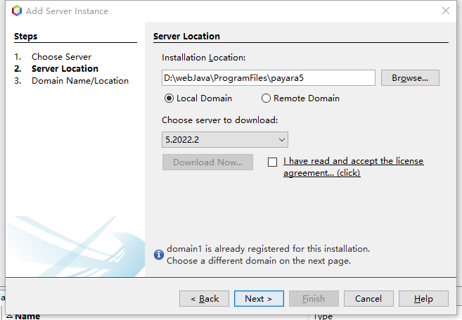
Step 4: Configuration server information.
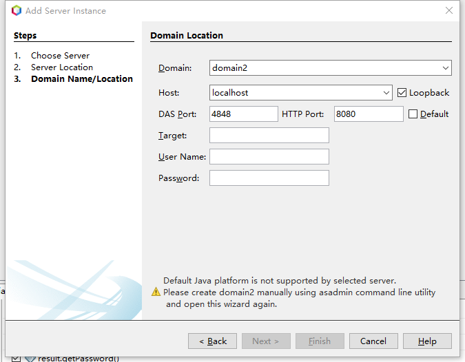
Step 4: Configuration server information.

<h4>Running programe  </h4>
Step 1: Chosen your project right click open properties
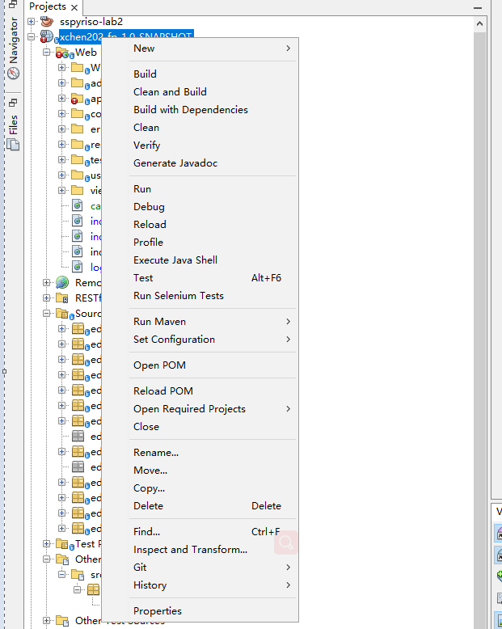
Step 2: Chose project run server.

Step 3: Project run.

Step 4: Open your browser and visit a website. http://localhost:8080/xchen202-fp/
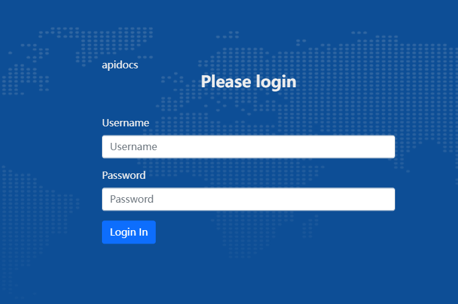

<h1>Screen Captures    </h1> 
<h4>Admin group test.  </h4>
login admin_Coach: admin_Coach  
<h5> User menu </h5>
Visit the user menu where you see the user list.  
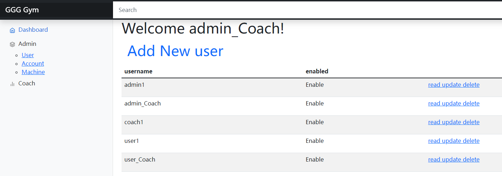
Click the red button. Enter the user information page. After clicking the Left Back linked came back user list page.  
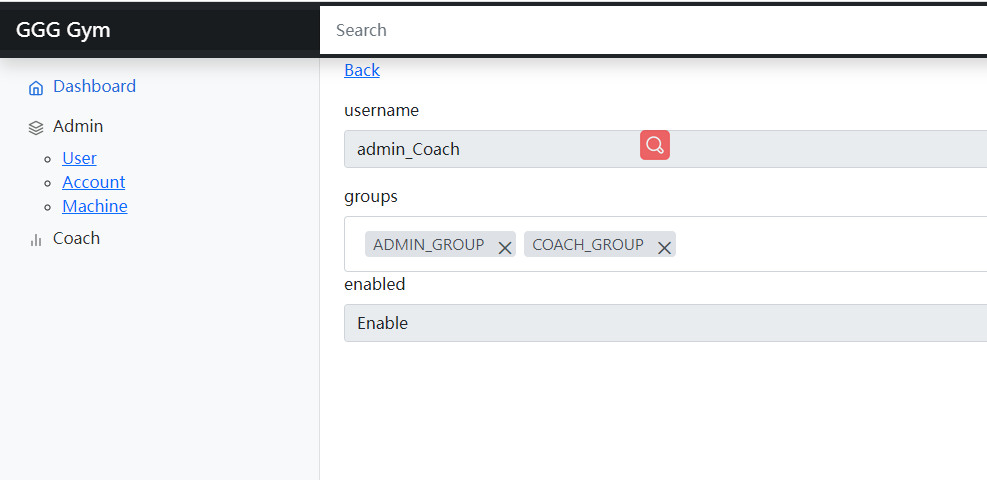
Click the linked "Add New User" and enter this page. When you click the "Create user" button. It will show every important tip to help input the right format.   
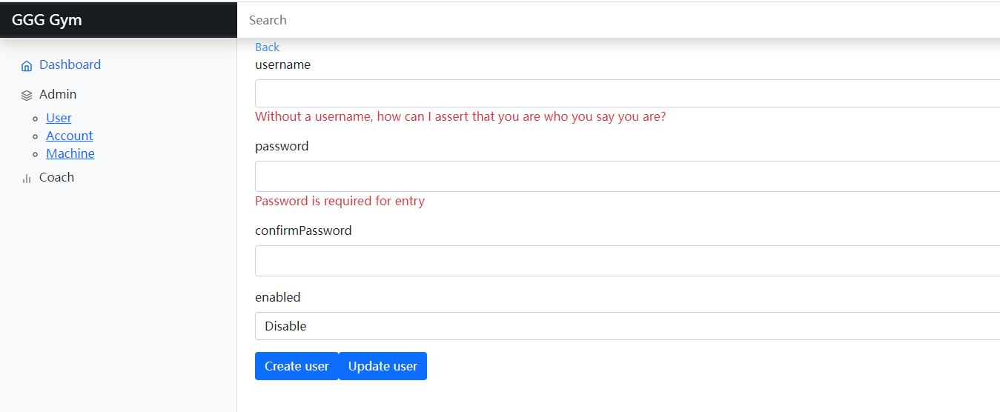
Validation password input.   
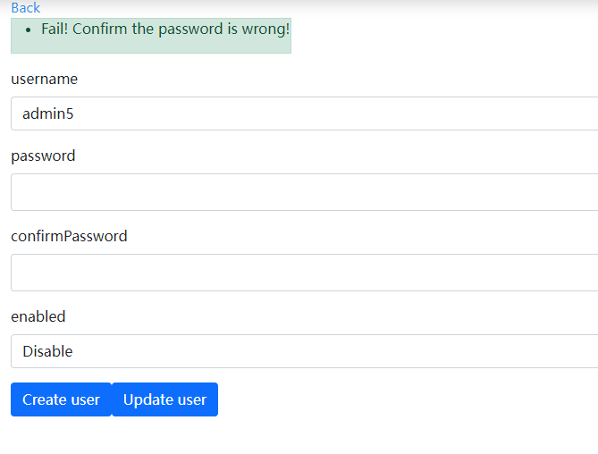
Click the delete button. Enter delete information page. After clicking the Confirm Deletion Button success after will forward the user list page.  
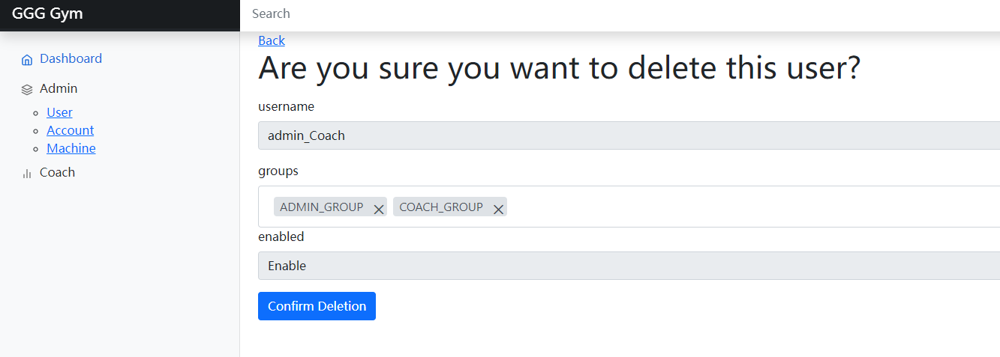

<h5> Account menu </h5>
Visit the account menu where you see the account list. Magnifying glass Icon and the red button is the same function.  
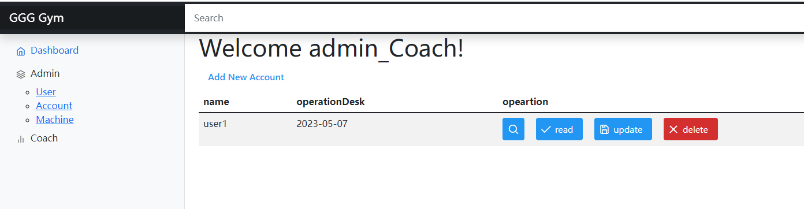
Click the red button. You can see a dialog view.      
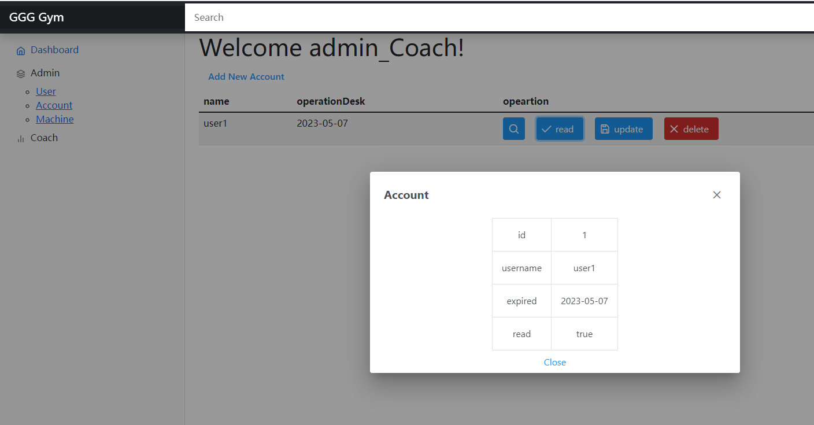
Click the Update button. You can see a dialog view.      
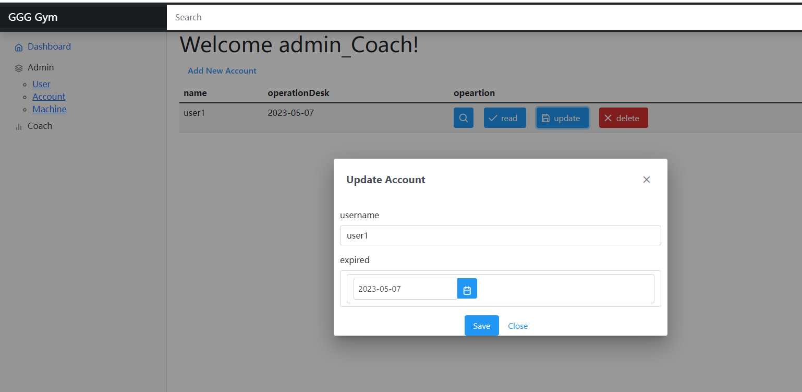
Delete Button success after will close the current dialog view.    
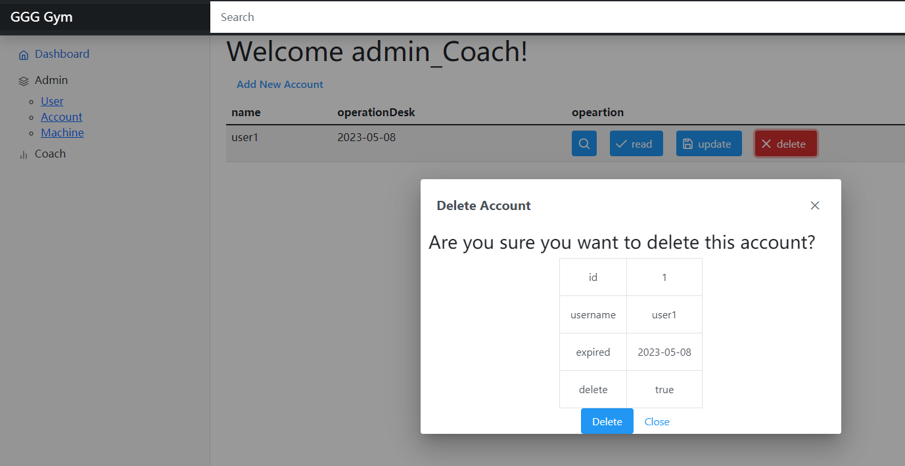

<h5> Machine menu </h5>
If the machine is not used that can be deleted. So you can add a new Machine.
For data example. 

			 name: (2022）Supreme Edition
	operationDesk: LED Blue screen	
			power: 3.0HP
			speed: 1.0-10 Gear	
			 size: 1100*510mm
		   weight: 38/45kg	
			price: 2999
	 machine type: EXPENSIVE

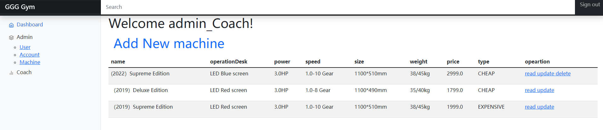
Click the update button. You can modify machine information.

If the machine does not been used you can delete it. Forward delete the page that Comfirm Deletion.
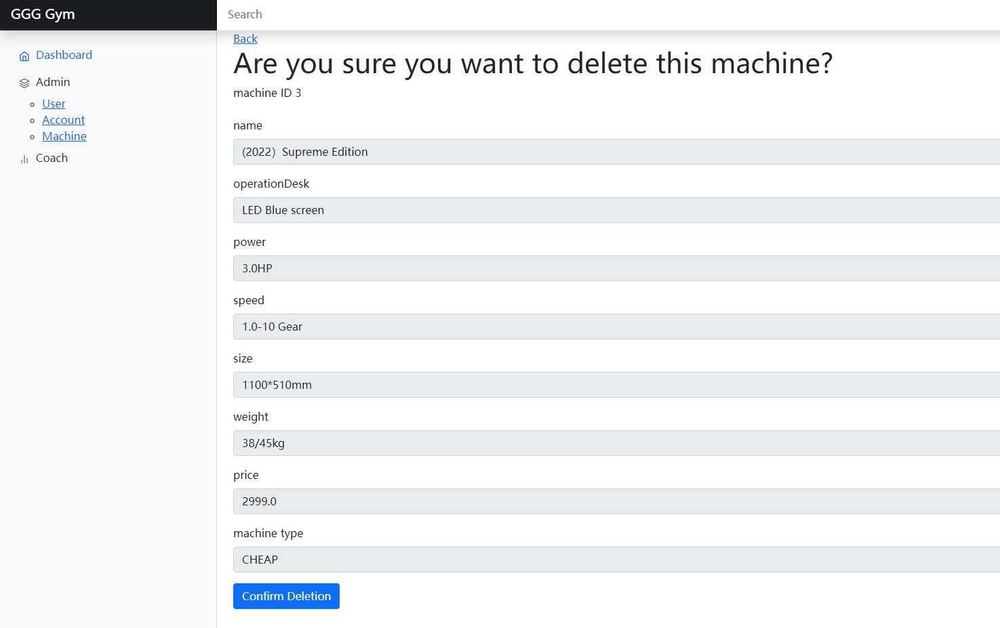

<h4>User group test.  </h4>
login user1: user1  
<h5> Treadmills menu </h5>
Click the menu Treadmills forward treadmills list.

Click the linked "record Treadmills".
For data example:

			 account: user1    
			 machine: (2022）Supreme Edition	     
			altitude: 0     
			 	kcal: 889   
			   mills: 8   
		   startDate: 2022/04/29	
			 useTime: 00:44:00 	

Click the delete linked forward to delete the page that you can click "Update Treadmills" to delete this data.
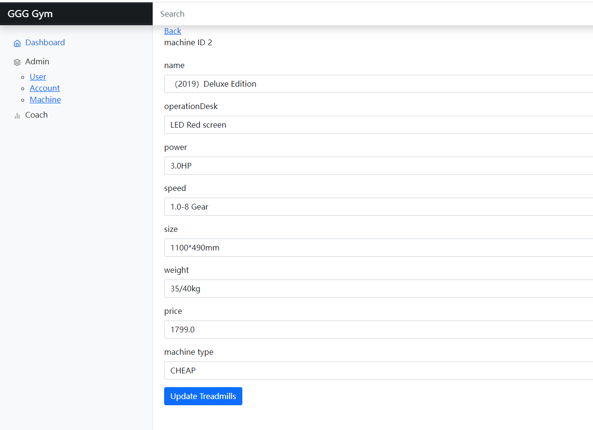
Click the delete linked forward to delete the page that you can click "Comfirm Deletion" to delete this data. 

<h1>Expected Results/Known Issues     </h1> 
Oh...no. I think I will lose a lot of scores.
<h4>I don't how to check the old password and the new password is the same.</h4>
On the update page, I implement a change password. The program logic is right. But API is not running is different. Every time execute "hash.generate(pwd)" it will get a different result.
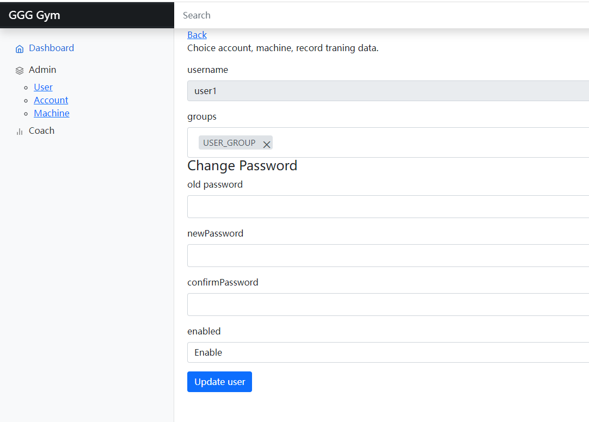
In User.java file I annotated this code. //@EntityListeners(UserListener.class)      
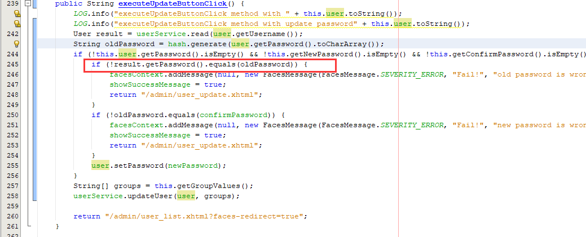

<h4>close button not work in create page.</h4>
The close button in creates a dialog view it does not work.  
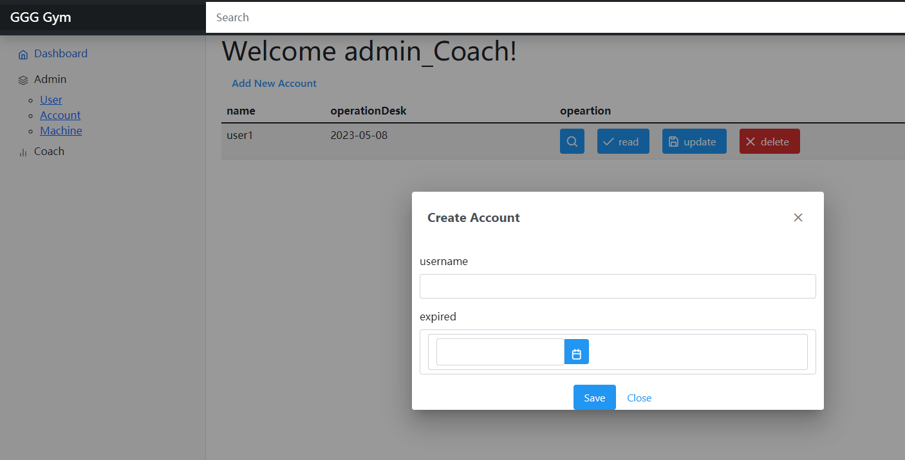
I only have the red square frame code that is different.

<h4>Close dialog view after how to refresh list pare.</h4>
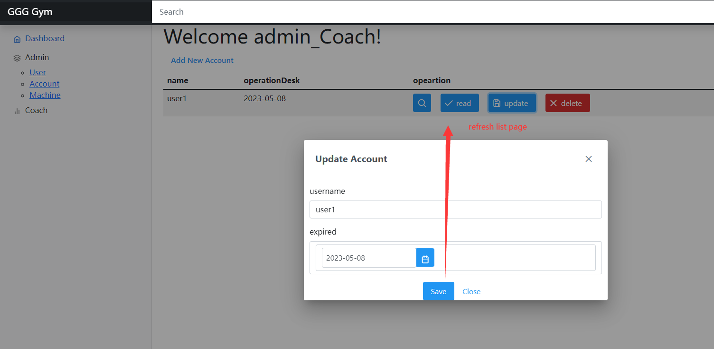

<h1>Development Insights     </h1>
The ITM 515 is a full-stack developer course. But I want to learn more about the back-end. In EJB teacher we more DialogActionListener is very cool. Following the course instructor's example will very easy to complete homework.
<h4>I need keep i real could completed all functionality!  </h4>
For midterm homework, I use quick property type tools. Design three group menus charge different staff to manage this system. But Final project I try use primefaces after I could complete the Coach part menu. I really feel I need to download a  project was use primifaces. Use the example of haven real project. Not a component. It lost some configuration and the code rule is very hard to use.

<h4>Something I feel very bad about.</h4>
I try to merge front-end read, update, and delete to us one page. Get the bug more and config parameters are more and more. I lost controller for my plan again.

    <p:commandButton value="read" action="#{formView.viewForm}" style="margin-right:20px;" styleClass="p-mr-2" icon="pi pi-check" >   
        <f:setPropertyActionListener value="#{form}" target="#{formView.form}" />      
        <f:setPropertyActionListener value="#{accountController.folder}" target="#{formView.folder}" />
        <f:setPropertyActionListener value="#{accountController.entityName}" target="#{formView.entityName}" />
        <f:setPropertyActionListener value="read" target="#{formView.operation}" />
        <f:setPropertyActionListener value="Account" target="#{formView.header}" />   
    </p:commandButton>   
This code does not work for refreshing the list page and closing the dialog view. But it stores data in MySQL.   

    <p:commandButton value="Save" styleClass="ui-confirmdialog-yes" rendered="#	{formView.operation == 'update'}">     
    	<f:actionListener binding="${accountController.executeUpdateButtonClick(formView.form, close)}"/>     
    	<f:actionListener binding="${formView.doSomethingAndCloseDialog()}"/>    
    </p:commandButton>     

In the Installation part. I want to use cmd to run the payara5 server deploy war program. But failed to do this. So I came back to use Netbeans to develop.

<h4>Personl summary</h4>
I don't want to lose the passion to do everything I want to do. In this course. I want to use primefaces DialogConfirm to implement every CRUD page view. After I was merging the Controller common method to GenericController. That is what I want to do.

Liking the real world we handle everything information every day. Every day we do repeat life and get a better life.  We analyze the last experience unit it became stable we call it perfect. 
We will operate every information to CRUD operation. I can use Generic or code -template-generator to save your time.

Two chinese student should know.
How to change default language of javadoc to English?
https://stackoverflow.com/c/itmd4515-spring-2022/questions/242
Hibernate Validator: Violation Message Language
https://stackoverflow.com/questions/43725532/hibernate-validator-violation-message-language

