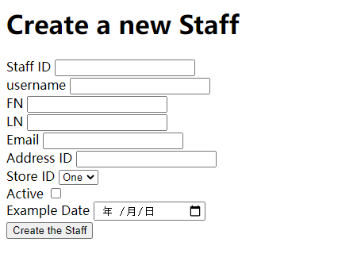
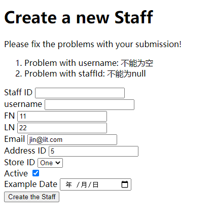
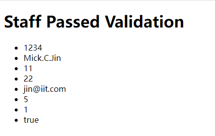
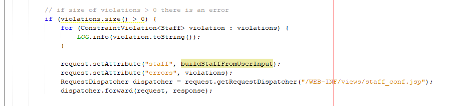
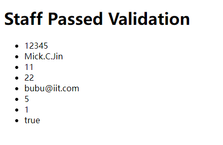

xchen202 Lab 3 README  

<h1>Part1：SNAPSHOTS  </h1>

I chose the table staff.     
Staff test url  
http://localhost:8080/xchen202-fp/staff  

Open the URL to display staff input data.  
  
If the validation is fail.  
  
The data was stored in MySql after the page will redirect to the information page.  
  

<h1>Part2：ANSWER  </h1>

4. Write a brief summary paragraph to document:    

1. Your understanding of the difference between the forward and redirect operations.  

Answer: main Differences Between Forward and Redirect The forward command is used to forward the request of the client from one JSP or servlet to another JSP or servlet, on the other hand, the redirect command is used to redirect the request of the client from one server to another server.  
forward will change URL path

2. How would you be validating user submissions without the Bean Validation API standard?  
On the JSP page, I will use the js or UI component for validation.
In Java, I will use a custom annotation tag to define rules.
Chapter 10: Bean Validation 10-2 Writing Custom Constraint Validators.

3. How do you think this approach would scale to a real application with 100's of entities?  
take list
<ul>
<li>. Have you seen some long SQL.  </li>
<li>. You will need some struct to help design different requirements. MVC will be a good model.  </li>
<li>. If you don’t use js to controller user action more useful. You will use a lot of java code.  </li>
<li>. You need to write a page SQL for the web table. It needs a lot of time to design.  </li>
<li>. You don’t want to same work to simple CRUD work time.  </li>
</ul>

4. Why didn't we need to include any additional dependencies (i.e. Bean Validation,JDBC) in this project?  

Answer: We don’t have business required. If customer need staff to buy film ticket. So we need a payment relationship for the film ticket.  

Refrences:
https://www.primefaces.org/showcase/ui/data/orderList.xhtml?jfwid=5ba54
OrderList

https://primefaces.github.io/primefaces/11_0_0/#/gettingstarted/download
pom.xml

https://getbootstrap.com/docs/5.1/examples/dashboard/index.html
WEB-inF/templates/appTemplate