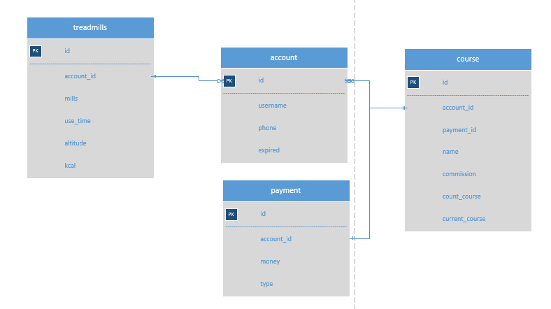
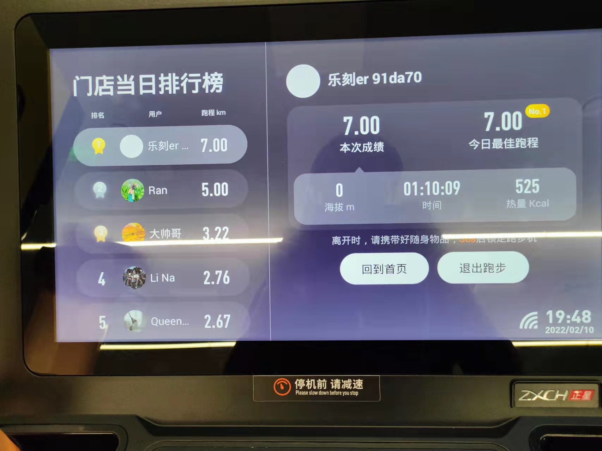
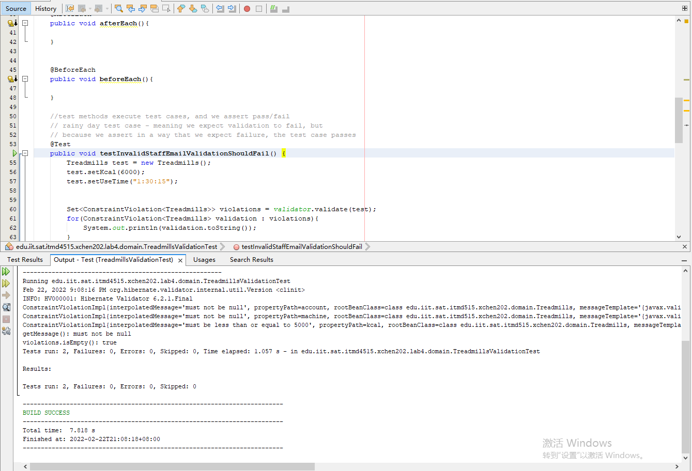
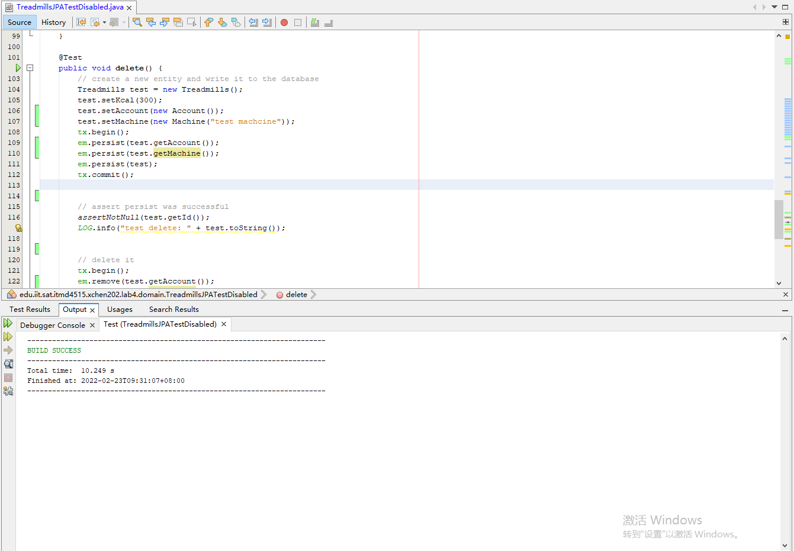

xchen202 Lab 4 README  

<h1>Part1：Project Requirements  </h1>

I chose the sports business domain.

I chose the sports business domain.
My gym membership has expired. I was going to find a new gym.
I will design some training plans.
It’s a long time not to training gym. First time I just walk. I found some information in my app/ treadmills.

I chose the table treadmills for lab4. This attachment is for ER.    
  
treadmills picture.  

app picture for ranking list
  

<h1>Part2：SNAPSHOTS  </h1>

TreadmillsValidationTest.java
  

TreadmillsJPATestDisabled.java

