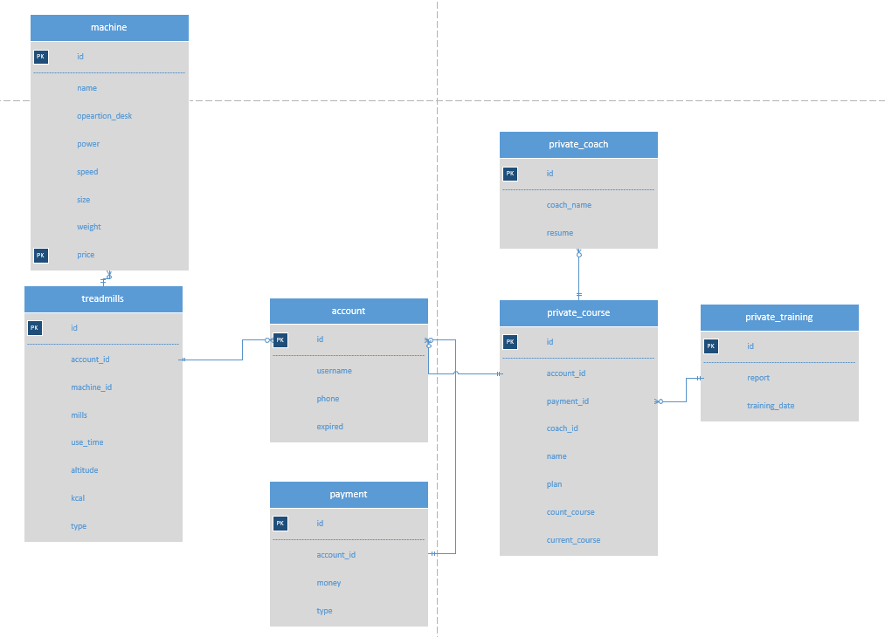
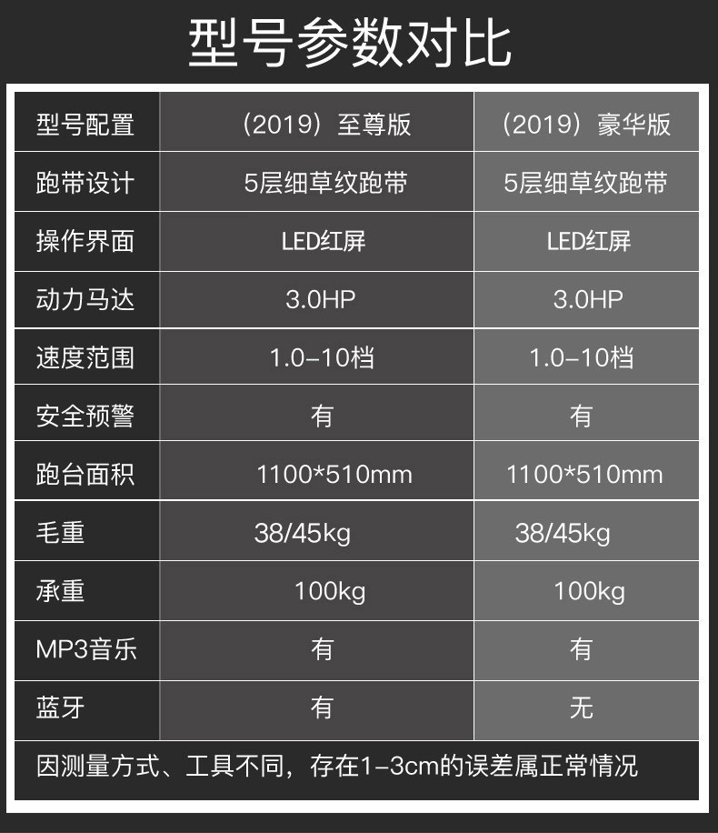
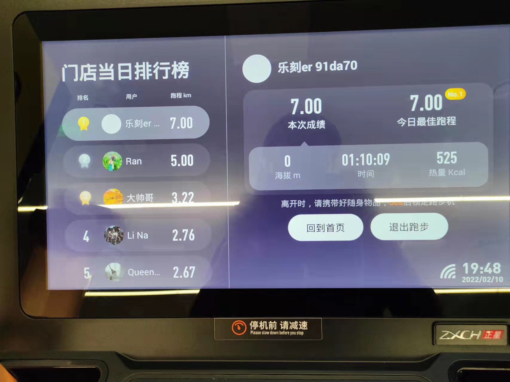
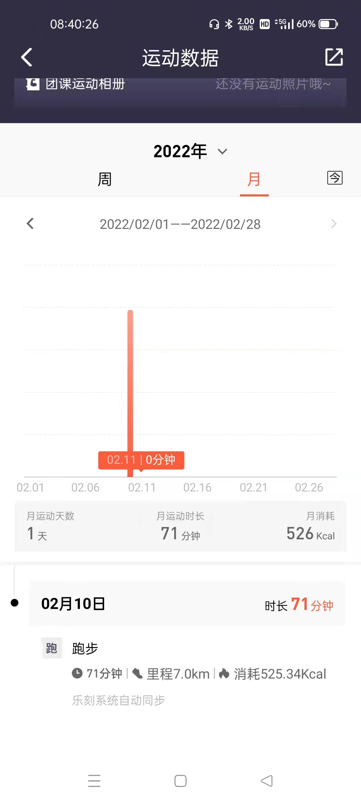
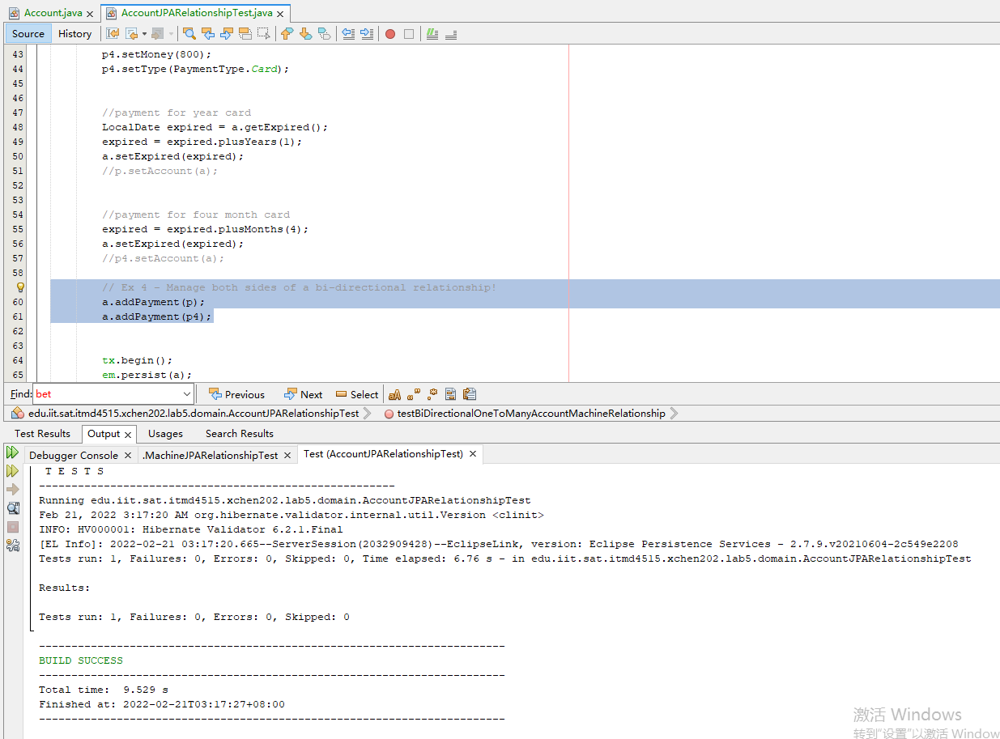
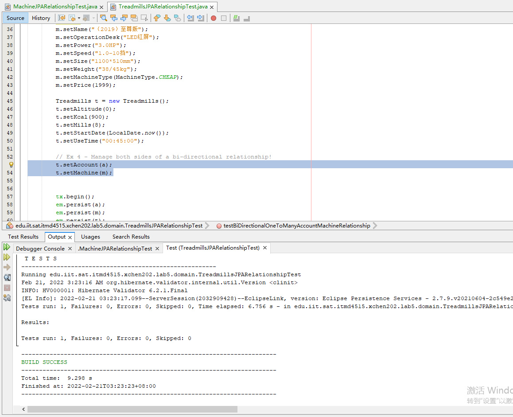
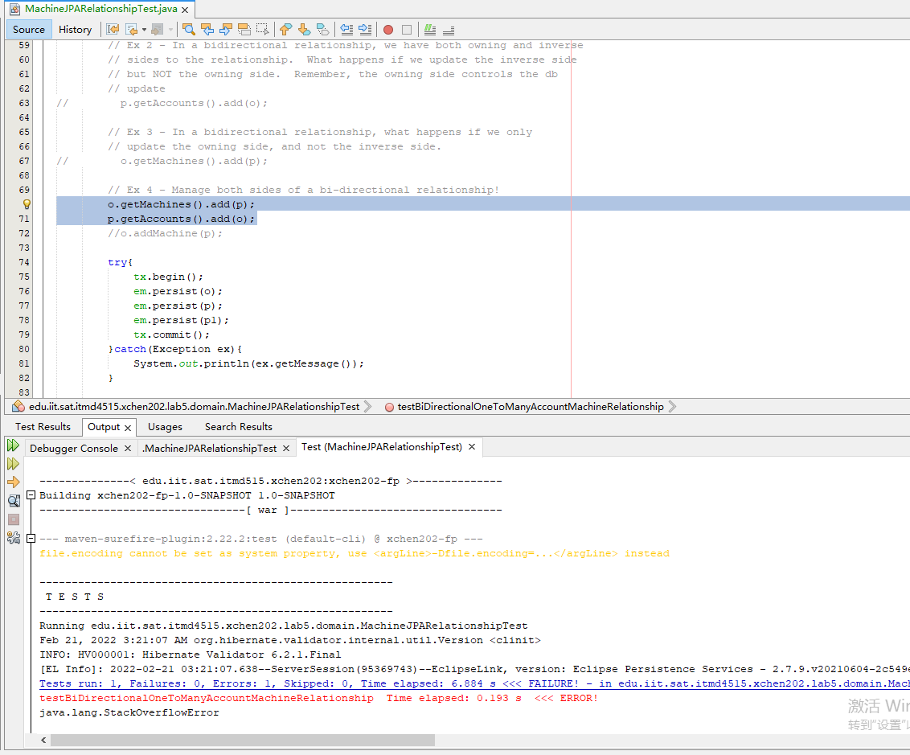
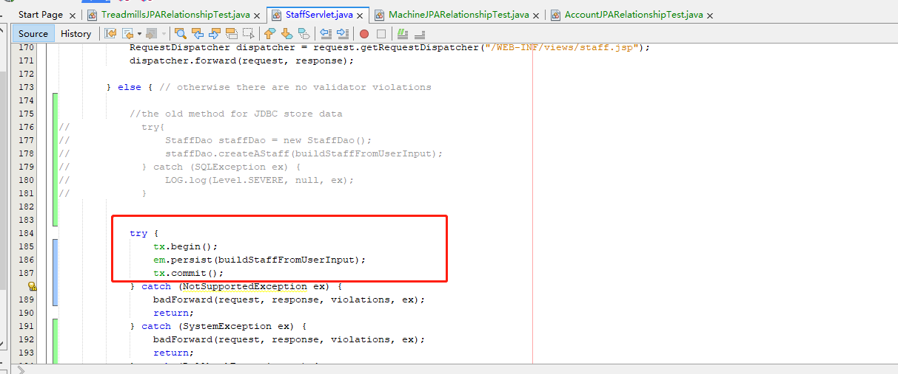

xchen202 Lab 5 README  

<h1>Part1：Project Requirements  </h1>

I chose the sports business domain.

Welcome to GGG gym. We have a nice service and smiling face.  
We have the new treadmills machine. It can store your training data. Just help you be better.  
Join us! Container our accounting consultant.  

It's my database design.
refrence: doc/lab5/treadmills.vsdx
ER.png

Treadmills tranining information. 
  
Treadmills machine information.  

Ranking List.    
  

<h1>Part2：SNAPSHOTS  </h1>

I'm sorry. I don't do @OneToOne. Because I don't find some business for my database design.
I think this test was complex. It was satisfying for lab5.

Test to the @OneToMany
AccountJPARelationshipTest.java  
1:M Account between and Payment  

TreadmillsJPARelationshipTest.java  
1:M Treadmills between and Account
1:M Treadmills between and Machine  

Test to the @ManyToMany
MachineJPARelationshipTest.java  
M:M Account between and Machine  
I'am so sorry! I can’t fix that issue.
When I test @ManyToMany. It's a must-have this issue. But the MySQL database stores data success.
refrence: https://stackoverflow.com/c/itmd4515-spring-2022/questions/143

Graduate / Undergraduate  

  