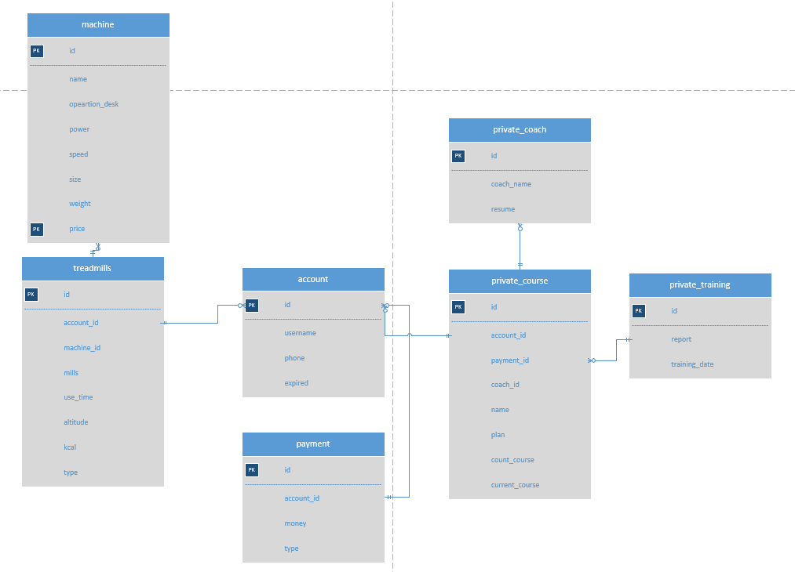
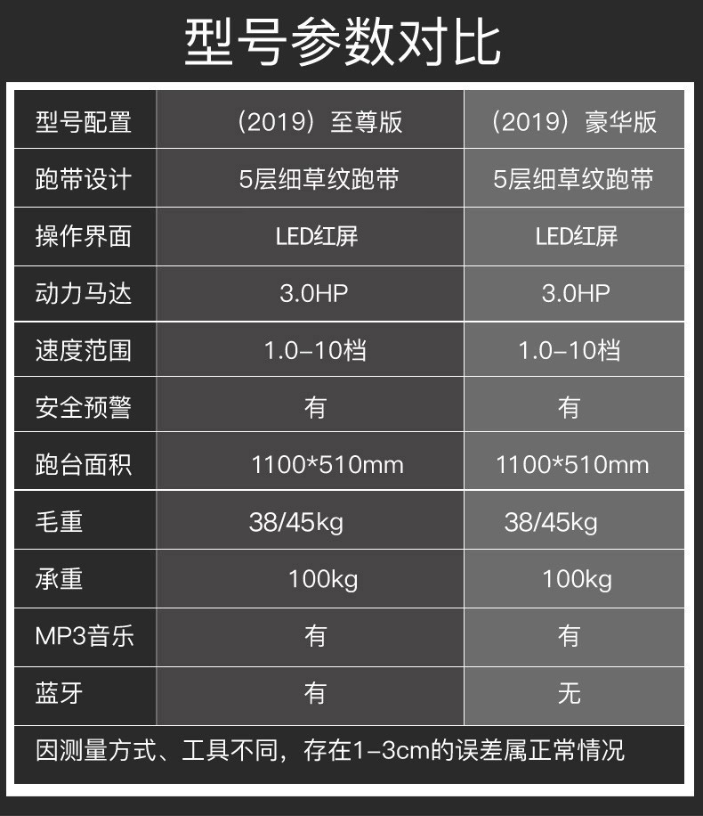

xchen202 Lab 6 README  

<h1>Part1：Project Requirements  </h1>

I chose the sports business domain.

Welcome to GGG gym. We have a nice service and smiling face.  
We have the new treadmills machine. It can store your training data. Just help you be better.  
Join us! Container our accounting consultant.  

It's my database design.
refrence: doc/lab6/treadmills.vsdx
ER.png

Treadmills tranining information. 
  
Treadmills machine information.  

Ranking List.    
  

<h1>Part2：SNAPSHOTS  </h1>

The loader path: edu.iit.sat.itmd515.xchen202. StartupDataLoader
In this lab. we will have the real situation.
First time! We go to the gym. The salesman will service you. Let you know the gym component.
When your decision became VIP for the gym. He will help activate the VIP card.

(Step1) Activate the VIP card.  
You need to pay some money to activate the card.  
After the reception staff will operate the system. Help create an account and give you a real card.  
(Step2) Use the Intelligent treadmill machine    
Login to the Intelligent use you account. Every time your end your training. The machine will upload data to the system.  
(Step3) Check treadmill training information  
Display all treadmills about your use situation.  
Get a ranking list of today.  

Test result
We can see rankingList has output console.

remark:  
I want to search for personal data.  
When I try to get Account object id. It’s empty!  
refrence: https://stackoverflow.com/c/itmd4515-spring-2022/questions/161

  
hhhha...I found NetBeans support js syntax.  
for(var i = 0; i < allRankingList.size(); i++){  
}  
Another. I don't why the "New Watch" is different for the output console.

