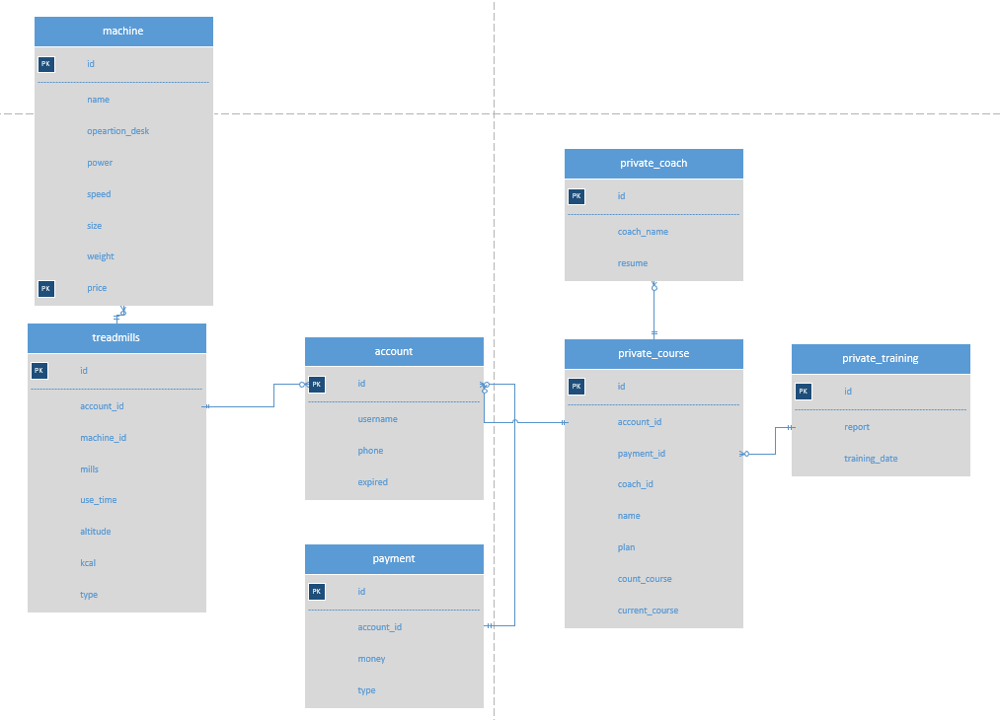
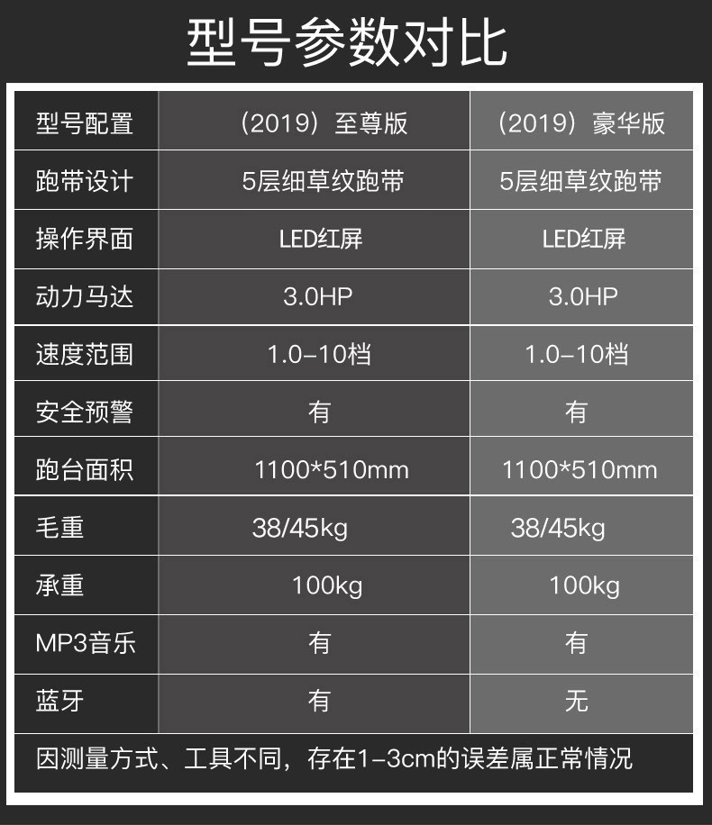
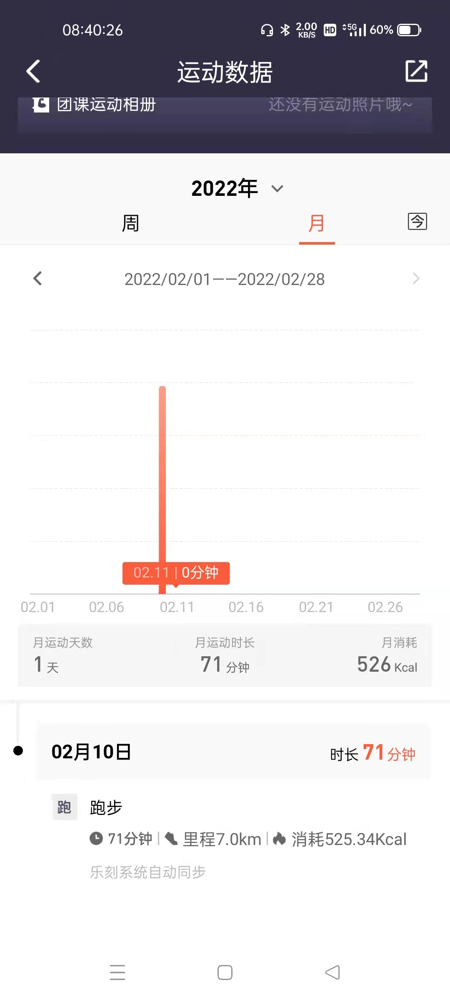
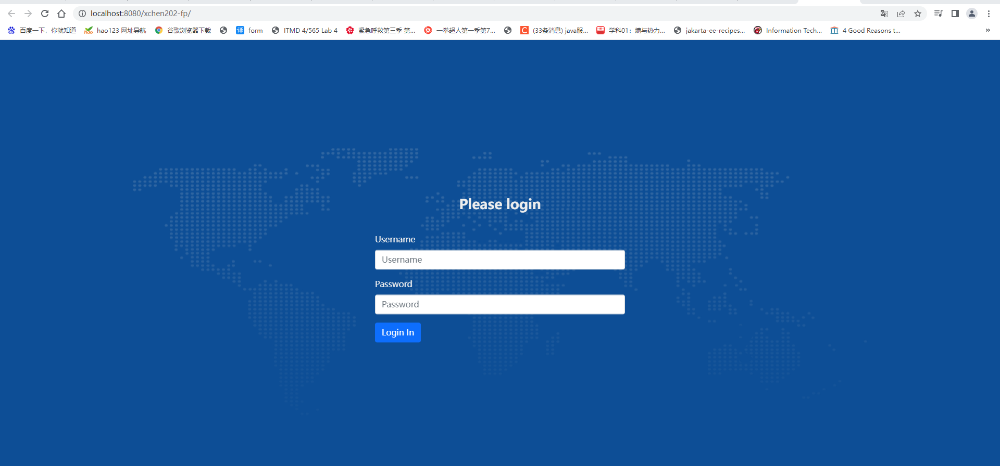
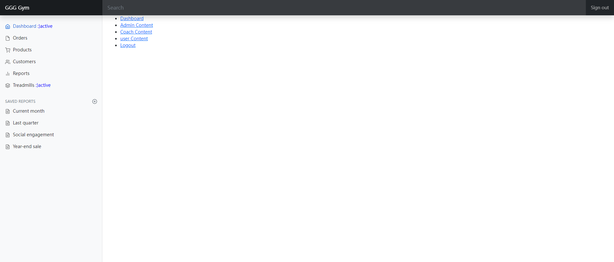
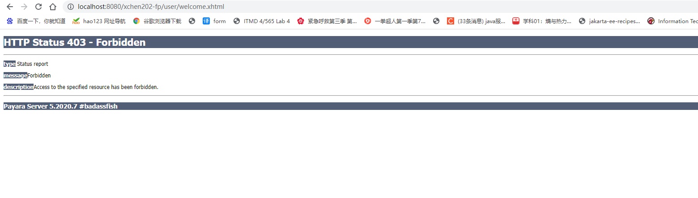
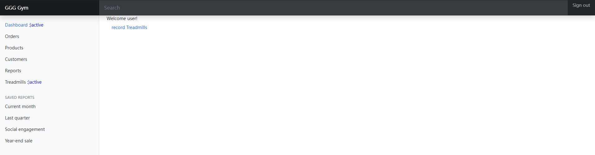
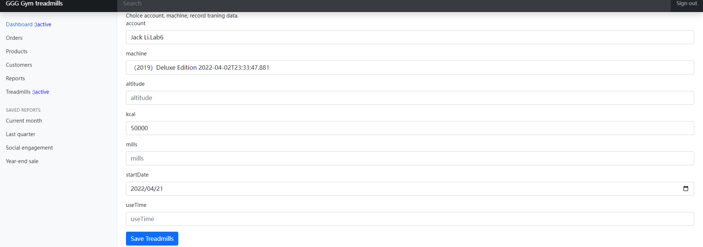
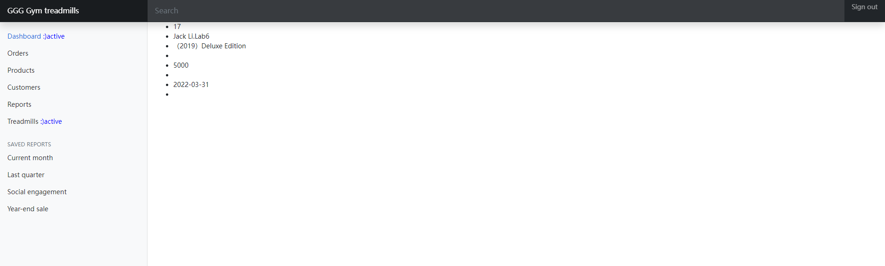

xchen202 Lab 8 README  

<h1>Part1：Project Requirements  </h1>

I chose the sports business domain.

Welcome to GGG gym. We have a nice service and smiling face.  
We have the new treadmills machine. It can store your training data. Just help you be better.  
Join us! Container our accounting consultant.  

It's my database design.
refrence: doc/lab6/treadmills.vsdx
ER.png

Treadmills tranining information. 
  
Treadmills machine information.  

Ranking List.    
  

<h1>Part2：SNAPSHOTS  </h1>

We have three roles.
ADMIN_ROLE,USER_ROLE,GUEST_ROLE
five users account.
admin_Coach:admin_Coach
user_Coach:user_Coach
admin1:admin1
coach1:coach1
user1:user1

Test result
This is login page.

home page
You can use the logout and Sign out.

When login user not permission.

User Page link to Lab8 page.

Record treadmills inofrmation.

Display treadmills information.
